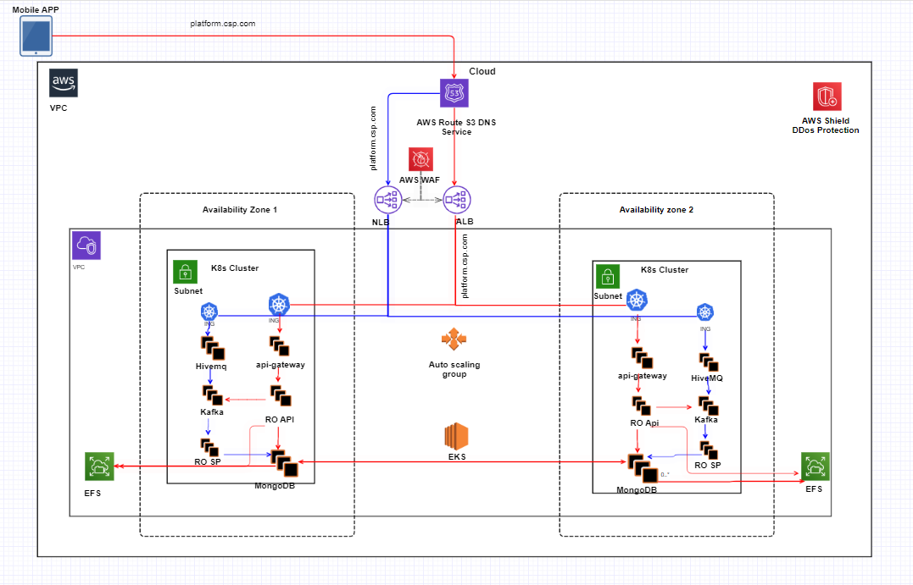
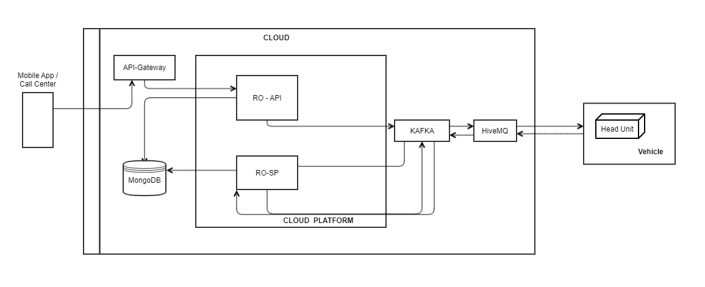
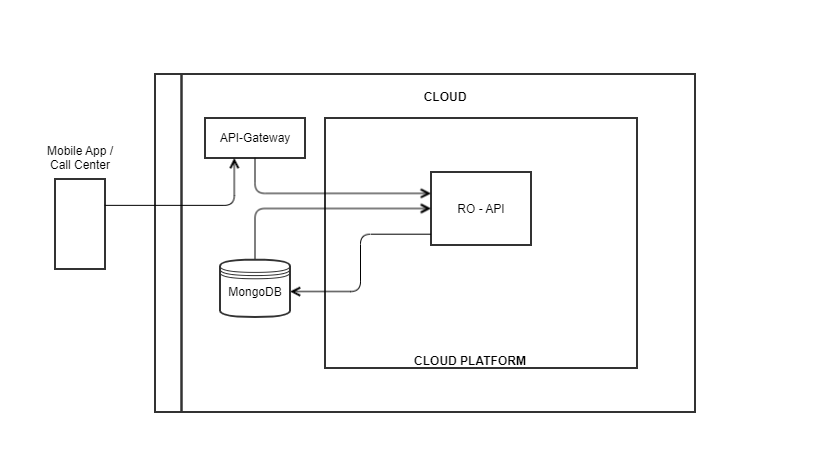

<div align="center">
    
</div>

# Remote Operations

[](https://github.com/eclipse-ecsp/ro/actions/workflows/ci-cd.yml)
[](https://github.com/eclipse-ecsp/ro/actions/workflows/license-compliance.yml)

Remote Operations is a service that can be used to push operations that can be executed in the vehicle and to get the response of the operation as notification.

Some of the supported remote operations are:

1. Remote Door Lock/Unlock 
2. Remote Driver Door Lock/Unlock 
3. Remote Start & Stop 
4. Remote Horns and Lights (aka. Panic)
5. Remote Climate Control On/Off 
6. Remote Window Open/Close/Partial Open 
7. Remote Driver Window Open/Close/Partial Open 
8. Remote Hood Open/Close 
9. Remote LiftGate Open/Close/Partial Open 
10. Remote Trunk Lock/Unlock
11. Remote Alarm On/Off
12. Remote Engine Start/Stop

All the above operations must be accessible via mobile app (Android/iOS), secured web-site and can also be executed through Call Center system (Call Center).

**_NOTE:_** 
System must be capable of authorizing any remote action by validating is user owns the vehicle.


# Table of Contents
* [Getting Started](#getting-started)
* [General Concepts](#general-concepts)
* [Architecture](#architecture)
* [Usage](#usage)
* [How to contribute](#how-to-contribute)
* [Built with Dependencies](#built-with-dependencies)
* [Code of Conduct](#code-of-conduct)
* [Authors](#authors)
* [Security Contact Information](#security-contact-information)
* [Support](#support)
* [Troubleshooting](#troubleshooting)
* [License](#license)
* [Announcements](#announcements)


## Getting Started

To build the project locally after it has been forked/cloned and the [dependencies](#built-with-dependencies) have been met, run:

```mvn clean install```

from the command line interface.

### Prerequisites

The list of tools required to build and run the project:
   - Java 17
   - Maven
   - Container environment

### Installation

- [Install Java 17](https://www.azul.com/downloads/?version=java-17-lts&package=jdk#zulu)

- [How to set up Maven](https://maven.apache.org/install.html)

- Install Docker on your machine by referring to official Docker documnentation to have a Container environment.

### Coding style check configuration

[checkstyle.xml](./checkstyle.xml) is the coding standard to follow while writing new/updating existing
code.

Checkstyle plugin [maven-checkstyle-plugin:3.2.1](https://maven.apache.org/plugins/maven-checkstyle-plugin/) is
integrated in [pom.xml](./pom.xml) which runs in the `validate` phase and `check` goal of the maven lifecycle and fails
the build if there are any checkstyle errors in the project.

To run checkstyle plugin explicitly, run the following command:
```mvn checkstyle:check```

### Running the tests

To run the tests for this system run the below maven command.

```mvn test```

Or run a specific test

```mvn test -Dtest="TheFirstUnitTest"```

To run a method from within a test

```mvn test -Dtest="TheSecondUnitTest#whenTestCase2_thenPrintTest2_1"```

### Deployment

`remote-operations` services are deployed in Kubernetes cluster hosted under AWS Cloud Infra.



#### Amount of resources required

| Component | Resource | Current | New  | Description                                       |
|:----------|:---------|:--------|:-----|:--------------------------------------------------|
| RO-API    | cpu      | 100m    | 100m | Pod max limit / (Number of containers in the Pod) |
|           | memory   | 2GB     | 2GB  | Pod max limit / (Number of containers in the Pod) |
| RO-SP     | cpu      | 100m    | 100m | Pod max limit / (Number of containers in the Pod) |
|           | memory   | 2GB     | 2GB  | Pod max limit / (Number of containers in the Pod) |


## General Concepts

| Concept           | Description                                                                                                                                                                                                                                                                                                       |
|-------------------|-------------------------------------------------------------------------------------------------------------------------------------------------------------------------------------------------------------------------------------------------------------------------------------------------------------------|
| Software Platform | This is a cloud-based platform that provides a set of services to enable the development of connected car applications.                                                                                                                                                                                           |
| Microservices     | The platform architecture is based on the microservices design paradigm to ensure loose coupling between different software components and gain better design and modularity.                                                                                                                                     |
| Identity server   | The platform uses IDAM server as its Identity Server to provide OpenID /OAuth 2.0/ SAML token generation and validation. IDAM server is used to set authorization rules for both end-users and admin users. In this phase, platform does not support federated authorization OTB.                                 |
| API Gateway       | API gateways expose business APIs that are being consumed by applications. Each API can be mapped one-to-one with an API of one of the microservices or it can consolidate a sequence of calls to different APIs of one or more microservices. Either way, only the gateway APIs are exposed to external use.     |
| Vehicle Profile   | Vehicle profile is data store to store the user data for lookup of vehicle for a user.                                                                                                                                                                                                                            |
| Kafka Cluster     | Kafka Messaging Cluster provides central backbone for messages handling and stream processing                                                                                                                                                                                                                     |
| MQTT Cluster      | MQTT Cluster is responsible for : Authenticating "Telematics client" and authorizing publishing and subscribing to topics defined in Event Global API Accepting inbound RO messages on RO related topics Publishing outbound RO messages on RO related topics Transferring RO messages to Kafka Messaging Cluster |
| Vehicle Head Unit | Head Unit is responsible for sending RO messages and accepting RO messages as defined per event spec.                                                                                                                                                                                                             |
| Association API   | Association API is responsible for checking the association of the user with the vehicle.                                                                                                                                                                                                                         |

## Architecture

### Remote Operations/Create Schedule/Delete Schedule




#### Data fetch/update operations



## Usage

### Interfaces

#### Interfaces of API GW to External (via api-gateway)

| S.No. | Interface ID   | Endpoint            | Description                                                   |
|:------|:---------------|:--------------------|:--------------------------------------------------------------|
| 1.    | 	GET_API_DOCS	 | GET api-docs/index.html	 | To get the base page with API description, An Open API Specs. |

#### Addition of New Apis and api-gateway Integration

To add any new API, one needs to add a method to any existing controller or need to create new controller in `ro-api` module under the `rest` package.

For integration of the APIs with the api-gateway, Can follow the below steps:

1. Adding @Operation for showing the summary and information about the api in api-gateway. https://docs.swagger.io/swagger-core/v2.0.0-RC3/apidocs/io/swagger/v3/oas/annotations/Operation.html
2. Adding @SecurityRequirement for token scope and authorization. https://docs.swagger.io/swagger-core/v2.0.0-RC3/apidocs/io/swagger/v3/oas/annotations/security/SecurityRequirement.html
3. Add the newly added end point in the given property `openapi.path.include` present in application properties of `ro-api` module.

#### Interfaces of API GW Components to Internal Only

| S.No. | Interface ID                      | Endpoint                                                                | Description                                           |
|:------|:----------------------------------|:------------------------------------------------------------------------|:------------------------------------------------------|
| 1     | 	Doors Lock/unlock                | 	PUT /v1.1/users/{userId}/vehicles/{vehicleId}/ro/doors                 | 	This will lock/unlock all doors other then Driver    |
| 2     | 	Driver Doors Lock/Unlock         | 	PUT /v1.1/users/{userId}/vehicles/{vehicleId}/ro/doors/driver          | 	This will lock/unlock only driver doors              |
| 3     | 	Hood Open/Close	                 | PUT /v1.1/users/{userId}/vehicles/{vehicleId}/ro/hood	                  | This will open/close the hood                         |
| 4     | 	Trunk Lock/Unlock                | PUT /v1.1/users/{userId}/vehicles/{vehicleId}/ro/trunk                  | 	This will lock/unlock trunk of the car               |
| 5     | 	LiftGate open/close/lock/unlock	 | PUT /v1.1/users/{userId}/vehicles/{vehicleId}/ro/liftgate               | 	This will lock/unlock and open/close the liftgate    |
| 6     | 	Windows Open/Close	              | PUT /v1.1/users/{userId}/vehicles/{vehicleId}/ro/windows                | 	This will lock/unlock all windows other then Driver  |
| 7     | 	Driver Windows Open/Close        | PUT /v1.1/users/{userId}/vehicles/{vehicleId}/ro/windows/driver         | 	This will lock/unlock only driver windows            |
| 8     | 	Horn Start/Stop                  | 	PUT /v1.1/users/{userId}/vehicles/{vehicleId}/ro/horn                  | 	This will start/stop horn of the car                 |
| 9     | 	Lights On/Off                    | 	PUT /v1.1/users/{userId}/vehicles/{vehicleId}/ro/lights                | 	This will turn on/off lights of the car              |
| 10    | Alarm On/Off	                     | PUT /v1.1/users/{userId}/vehicles/{vehicleId}/ro/alarm	                 | This will turn on/off alarm of the car                |
| 11    | Engine Start/Stop                 | PUT /v1.1/users/{userId}/vehicles/{vehicleId}/ro/engine                 | 	This will start/stop engine of the car               |
| 12    | Climate Control On/Off	           | 	PUT /v1.1/users/{userId}/vehicles/{vehicleId}/ro/climate               | 	This will turn on/off the climate control of the car |
| 13    | Create RO Configuration           | PUT /v1.1/users/{userId}/vehicles/{vehicleId}/ro/config                 | 	This will create the RO configurations.              |
| 14    | Get RO Configuration	             | GET /v1.1/users/{userId}/vehicles/{vehicleId}/ro/config                 | 	This will get the RO configurations.                 |
| 15    | Get RO Status	                    | GET /v1.1/users/{userId}/vehicles/{vehicleId}/ro/requests/{roRequestId} | 	This will get the remote operation status            |
| 16    | Get RO History	                   | GET /v1.1/users/{userId}/vehicles/{vehicleId}/ro/history                | 	This will get this history of RO operations on car   |
| 17    | Schedule RO Engine Start/Stop	    | PUT /v2/users/{userId}/vehicles/{vehicleId}/ro/engine/                  | 	This will schedule Engine to Start/Stop              |
| 18    | Delete Schedule	                  | DELETE /v1/users/{userId}/vehicles/{vehicleId}/ro/{roType}/schedule     | 	This will delete a schedule                          |
| 19    | Get Schedule List	                | GET /v1/users/{userId}/vehicles/{vehicleId}/ro/{roType}/schedules/      | 	This will get the list of schedules                  |
| 20    | Common Response Update	           | PUT /v1.0/users/{userId}/vehicles/{vehicleId}/ro/response               | 	HTTPS data feed response for Remote Operation        |

## Built With Dependencies

### Feature Dependencies

The following features are necessary to implement this feature:

| Dependency          | Purpose                                                                                                                                                                                                                                                                                                       |
|:--------------------|:--------------------------------------------------------------------------------------------------------------------------------------------------------------------------------------------------------------------------------------------------------------------------------------------------------------|
| API Gateway         | API gateways expose business APIs that are being consumed by applications. Each API can be mapped one-to-one with an API of one of the microservices or it can consolidate a sequence of calls to different APIs of one or more microservices. Either way, only the gateway APIs are exposed to external use. | 
| Vehicle Profile     | Vehicle profile is data store to store the user data for lookup of vehicle for a user.                                                                                                                                                                                                                        |
| Notification Center | To send and receive notifications                                                                                                                                                                                                                                                                             |
| WAM and Amazon SNS  | To send Remote Operation commands to vehicles in offline state (possibly due to Ignition off) via Shoulder Tap message issued to vehicle                                                                                                                                                                      |
| MongoDB             | NoSQL DB to store data                                                                                                                                                                                                                                                                                        | 
| Association API     | Association API is responsible for checking the association of the user with the vehicle.                                                                                                                                                                                                                     |

### External Dependencies and Risks

| Dependency        | Description                                               | Risk                                                                              |
|:------------------|:----------------------------------------------------------|:----------------------------------------------------------------------------------|
| Vehicle Head Unit | Vehicle Head Unit & Scheduler must have MQTT connectivity | If MQTT connection is not established then remote operations cannot be performed. |

## How to contribute

Please read [CONTRIBUTING.md](./CONTRIBUTING.md) for details on our contribution guidelines, and the process for submitting pull requests to us.

## Code of Conduct

Please read [CODE_OF_CONDUCT.md](./CODE_OF_CONDUCT.md) for details on our code of conduct.

## Contributors

Check here the list of [contributors](https://github.com/eclipse-ecsp/ro/graphs/contributors) who participated in this project.

## Security Contact Information

Please read [SECURITY.md](./SECURITY.md) to raise any security related issues.

## Support

Contact the project developers via the project's "dev" list - [ecsp-dev](https://accounts.eclipse.org/mailing-list/)

## Troubleshooting

Please read [CONTRIBUTING.md](./CONTRIBUTING.md) for details on how to raise an issue and submit a pull request to us.

## License

This project is licensed under the Apache-2.0 License - see the [LICENSE](./LICENSE) file for details.

## Announcements

All updates to this library are present in our [releases page](https://github.com/eclipse-ecsp/ro/releases).
For the versions available, see the [tags on this repository](https://github.com/eclipse-ecsp/ro/tags).

